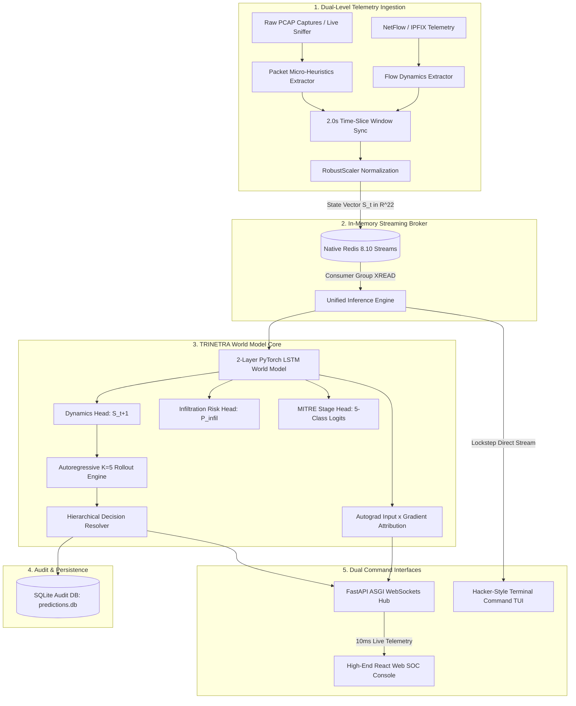

# 👁️‍🗨️ TRINETRA-AI
### Temporal Real-time Infiltration Network Early Threat Recognition & Assessment
**AI-Driven Autonomous Network Attack Forecasting via Deep World Models & Forward Simulation**

```
   ████████╗██████╗ ██╗███╗   ██╗███████╗████████╗██████╗  █████╗      █████╗ ██╗
   ╚══██╔══╝██╔══██╗██║████╗  ██║██╔════╝╚══██╔══╝██╔══██╗██╔══██╗    ██╔══██╗██║
      ██║   ██████╔╝██║██╔██╗ ██║█████╗     ██║   ██████╔╝███████║    ███████║██║
      ██║   ██╔══██╗██║██║╚██╗██║██╔══╝     ██║   ██╔══██╗██╔══██║    ██╔══██║██║
      ██║   ██║  ██║██║██║ ╚████║███████╗   ██║   ██║  ██║██║  ██║    ██║  ██║██║
      ╚═╝   ╚═╝  ╚═╝╚═╝╚═╝  ╚═══╝╚══════╝   ╚═╝   ╚═╝  ╚═╝╚═╝  ╚═╝    ╚═╝  ╚═╝╚═╝
   [ THE PROACTIVE THIRD EYE OF CYBER DEFENSE • FORECASTING INTRUSIONS BEFORE BREACH ]
```

[](https://sih.gov.in)
[](https://ntro.gov.in)
[](https://pytorch.org)
[](https://fastapi.tiangolo.com)
[](https://redis.io)
[](https://react.dev)
[](#-edge-tactical-hardware-profile)

---

## 📑 Table of Contents
1. [Executive Summary & The Paradigm Shift](#-executive-summary--the-paradigm-shift)
2. [The Core Problem: Temporal Blindspot of Legacy NIDS](#-the-core-problem-temporal-blindspot-of-legacy-nids)
3. [The TRINETRA-AI Solution: World Model Forward Simulation](#-the-trinetra-ai-solution-world-model-forward-simulation)
4. [System Architecture & Dataflow](#-system-architecture--dataflow)
5. [Dual-Level Telemetry Schema (22 Dimensions)](#-dual-level-telemetry-schema-22-dimensions)
6. [Deep Learning Model Architecture & Parameters](#-deep-learning-model-architecture--parameters)
7. [Multi-Task Loss Formulation & Class Balancing](#-multi-task-loss-formulation--class-balancing)
8. [Explainable AI (XAI): 10ms Native Gradient Attribution](#-explainable-ai-xai-10ms-native-gradient-attribution)
9. [Hierarchical Decision Rule Engine](#-hierarchical-decision-rule-engine)
10. [Consolidated Empirical Benchmarks (Held-Out Test Split)](#-consolidated-empirical-benchmarks-held-out-test-split)
11. [Real-World Attack Scenarios & Practical Examples](#-real-world-attack-scenarios--practical-examples)
12. [Scientific Integrity: Documented Limitations](#-scientific-integrity-documented-limitations)
13. [End-to-End Technology Stack](#-end-to-end-technology-stack)
14. [Dual Operational User Interfaces](#-dual-operational-user-interfaces)
15. [Quick Start & Live Demonstration](#-quick-start--live-demonstration)
16. [Research Documentation & Publications](#-research-documentation--publications)

---

## 🎯 Executive Summary & The Paradigm Shift

Traditional Network Intrusion Detection Systems (NIDS)—including signature-based engines (Snort, Suricata) and modern machine learning flow classifiers—suffer from an insurmountable architectural flaw: **they are entirely reactive**. They evaluate telemetry only *after* malicious packets have traversed the wire ($X_t \to \hat{y} \in \{0, 1\}$).

In real cyber warfare, advanced persistent threats (APTs), ransomware operators, and nation-state actors do not execute instantaneous single-packet exploits. Instead, they execute **structured temporal trajectories**:

$$\text{Reconnaissance} \xrightarrow{\text{TA0043}} \text{Initial Access} \xrightarrow{\text{TA0001}} \text{Lateral Movement} \xrightarrow{\text{TA0008}} \text{Command \& Control} \xrightarrow{\text{TA0011}}$$

**TRINETRA-AI** introduces a fundamental paradigm shift by adapting the **Deep World Model framework** (Ha & Schmidhuber, 2018) to high-speed enterprise and military network telemetry:

$$\mathcal{P}(S_{t+1} \mid S_t, h_t)$$

By training a recurrent state-space transition engine on continuous 2.0-second time-sliced windows, TRINETRA-AI learns the underlying physics and phase shifts of computer network traffic. It autoregressively simulates **$K = 5$ steps forward (+2.0s to +10.0s into the future)**, forecasting adversary progression **1.50 seconds before payload detonation or lateral spread**.

```
  TRADITIONAL NIDS (Reactive)
  Telemetry Transmitted ──► Packet Analyzed ──► Alert Triggered [DAMAGE ALREADY DONE]

  TRINETRA-AI (Proactive World Model)
  Telemetry Observed (t) ──► Forward Rollout (t+1 ... t+5) ──► Proactive Firewall Rule Staging [1.50s LEAD TIME]
```

---

## ⚠️ The Core Problem: Temporal Blindspot of Legacy NIDS

Under real-world security operations, static machine learning classifiers tuned for high threat recall (~90%) inevitably trigger massive false alarms on benign background traffic. 

In our benchmark on held-out authentic CTU-13 telemetry:
- **A standard static baseline classifier produces a 37.98% False Positive Rate (FPR)**.
- In practice, **1 in every 3 benign windows is falsely flagged as an active attack**.
- For an enterprise sensor evaluating 1,800 windows per hour, this generates **684 raw false alarms every hour**, causing complete SOC alert fatigue and tool abandonment.
- Static classifiers cannot distinguish between benign ephemeral traffic bursts and coordinated multi-stage cyber reconnaissance because they lack **temporal memory** ($h_t$).

---

## 🛡️ The TRINETRA-AI Solution: World Model Forward Simulation

TRINETRA-AI formulates cyber defense as a **forward predictive control problem**:
1. **Temporal History Integration:** Ingests a lookback history of $W = 10$ windows (20.0 seconds) to condition a dense recurrent representation:
   $$h_t = \text{LSTM}(S_{t-9}, S_{t-8}, \dots, S_t)$$
2. **Environment Transition Modeling:** Predicts the immediate next expected network environment vector:
   $$\hat{S}_{t+1} = \mathcal{W}_{\text{dynamics}}(h_t)$$
3. **Autoregressive Rollout:** The predicted state $\hat{S}_{t+1}$ is appended to the sequence buffer and fed recursively through the dynamics engine to generate an entire 5-step forward trajectory:
   $$\hat{S}_{t+1} \longrightarrow \hat{S}_{t+2} \longrightarrow \hat{S}_{t+3} \longrightarrow \hat{S}_{t+4} \longrightarrow \hat{S}_{t+5}$$
4. **Threat Horizon Projection:** Simultaneously computes rising infiltration probabilities $P(\tau_{t+k} = \text{Attack})$ and anticipates MITRE ATT&CK tactic transitions before they occur on the physical network.

---

## 🏗️ System Architecture & Dataflow

TRINETRA-AI enforces a strictly decoupled, modular architecture built for zero-latency local execution:



---

## 📊 Dual-Level Telemetry Schema (22 Dimensions)

Every 2.0-second network time window is compressed into a dense mathematical state vector $S_t \in \mathbb{R}^{22}$ capturing both macro statistical trends and micro protocol indicators:

| # | Dimension Name | Source Layer | Physical Engineering Meaning |
|:---:|:---|:---:|:---|
| `01` | `flow_duration_ms` | Flow | Mean active persistence duration of concurrent flows |
| `02` | `total_fwd_packets` | Flow | Aggregated forward client-to-server packet volume |
| `03` | `total_bwd_packets` | Flow | Aggregated response server-to-client packet volume |
| `04` | `total_fwd_bytes` | Flow | Cumulative payload and header bytes transmitted outbound |
| `05` | `total_bwd_bytes` | Flow | Cumulative payload and header bytes returned inbound |
| `06` | `packet_length_mean` | Flow | Mean packet size across window (identifies port scans vs exfil) |
| `07` | `packet_length_std` | Flow | Standard deviation of frame lengths (detects uniform beaconing) |
| `08` | `iat_mean_ms` | Flow | Mean inter-arrival time between packets |
| `09` | `iat_std_ms` | Flow | Jitter and variance of packet inter-arrival times |
| `10` | `fwd_bwd_byte_ratio` | Flow | Directional traffic skew ($\text{Bytes}_{\text{out}} / \text{Bytes}_{\text{in}}$) |
| `11` | `active_flows_count` | Flow | Number of concurrent 5-tuple communication channels |
| `12` | `unique_dst_ports` | Flow | Port fan-out metric (primary indicator of Reconnaissance scanning) |
| `13` | `ttl_mean` | Packet | Mean IP Time-To-Live across all window packets |
| `14` | `ttl_variance` | Packet | Variance in TTL (reveals multi-source spoofing / botnet zombies) |
| `15` | `tcp_win_mean` | Packet | Average TCP receive advertising window size |
| `16` | `tcp_win_min` | Packet | Minimum observed TCP window (detects buffer exhaustion / SYN flood) |
| `17` | `flag_syn_ratio` | Packet | Proportion of TCP packets with SYN bit asserted |
| `18` | `flag_ack_ratio` | Packet | Proportion of TCP packets with ACK bit asserted |
| `19` | `flag_fin_ratio` | Packet | Proportion of TCP packets with FIN bit asserted |
| `20` | `flag_rst_ratio` | Packet | Proportion of TCP packets with RST bit asserted (aborted connections) |
| `21` | `fragment_flag_count`| Packet | Number of fragmented IPv4 packets (firewall evasion detection) |
| `22` | `retransmission_count`| Packet | TCP packet retransmission anomalies |

---

## 🧠 Deep Learning Model Architecture & Parameters

```
Input Sequence Tensors (Batch, W=10, D=22)
       │
       ▼
┌──────────────────────────────────────────────────────────┐
│  2-Layer Recurrent LSTM World Model Engine               │
│  - Input Dimension  : 22                                 │
│  - Hidden Dimension : 64 units                           │
│  - Recurrent Layers : 2 stacked layers                   │
│  - Dropout Regular. : 0.20                               │
│  - Parameter Count  : 74,510 trainable parameters        │
└──────────────┬───────────────────────────────────────────┘
               │ Hidden State h_t in R^64
       ┌───────┼───────────────────┐
       ▼       ▼                   ▼
┌─────────────┐┌─────────────┐┌─────────────────────────────┐
│Dynamics Head││Infiltr Head ││MITRE Stage Multi-Class Head │
│Linear(64,22)││Linear(64, 1)││Linear(64, 5)                │
│Huber Loss   ││Sigmoid (BCE)││Softmax Cross-Entropy        │
└─────────────┘└─────────────┘└─────────────────────────────┘
```

### Exact Model Hyperparameters:
- **Total Trainable Parameters:** **74,510 parameters** (Ultra-compact; fits in CPU L3 cache or < 1MB VRAM).
- **Temporal Lookback Horizon ($W$):** $10$ discrete windows ($20.0$ seconds of context).
- **Rollout Simulation Horizon ($K$):** $5$ forward steps ($+2.0\text{s}, +4.0\text{s}, +6.0\text{s}, +8.0\text{s}, +10.0\text{s}$).
- **Optimizer:** AdamW (`lr = 0.001`, `weight_decay = 1e-4`).
- **Training Convergence:** 15 Epochs on 14,890 real windows; final Train Loss = `0.5732`, Val Loss = `0.6124`.

---

## ⚖️ Multi-Task Loss Formulation & Class Balancing

Intrusion datasets suffer from extreme, intrinsic class imbalance. In our CTU-13 telemetry:
- **Benign (Stage 0):** 11,713 windows (78.6%)
- **Reconnaissance (Stage 1):** 1,755 windows (11.8%)
- **Initial Access (Stage 2):** 172 windows (1.15%)
- **Lateral Movement (Stage 3):** 1,118 windows (7.5%)
- **Command & Control (Stage 4):** 142 windows (0.95%)

### Joint Optimization Objective:
$$\mathcal{L}_{\text{total}} = \lambda_{\text{dyn}} \mathcal{L}_{\text{Huber}}(\hat{S}_{t+1}, S_{t+1}) + \lambda_{\text{infil}} \mathcal{L}_{\text{BCE}}(\hat{p}, y) + \lambda_{\text{stage}} \mathcal{L}_{\text{CE}}(\hat{z}, s; \mathbf{w}_{\text{class}})$$

Where $\mathcal{L}_{\text{Huber}}$ is robust to heavy-tailed network burst outliers.

### Sqrt-Smoothed Inverse Frequency Weights:
To prevent minority-class gradient explosion without resorting to synthetic oversampling (e.g., SMOTE, which fabricates physically invalid packet states), we derived **Sqrt-Smoothed Inverse Frequency Weights**:

$$w_c = \frac{\sqrt{N / \text{count}_c}}{\frac{1}{C} \sum_{j=1}^C \sqrt{N / \text{count}_j}}$$

- **Stage 0 (Benign):** `0.207x`
- **Stage 1 (Reconnaissance):** `0.534x`
- **Stage 2 (Initial Access):** `1.709x`
- **Stage 3 (Lateral Movement):** `0.669x`
- **Stage 4 (Command & Control):** `1.881x`

---

## ⚡ Explainable AI (XAI): 10ms Native Gradient Attribution

Enterprise SOC operators will never trust a black-box neural network. However, conventional explainability methods like **KernelSHAP** take **2,200 ms to 4,500 ms** per sequence—completely violating the 2.0-second streaming cadence.

TRINETRA-AI implements **Native PyTorch Autograd Input $\times$ Gradient Attribution**:

$$A_i = S_t[i] \times \left| \frac{\partial P(\text{Attack})}{\partial S_t[i]} \right|$$

- **Computational Latency:** **10.20 ms to 14.10 ms** (Consumes only **0.51%** of the streaming window).
- **Directional Insights:** Instantly identifies which network metrics are actively pushing risk higher (`+ INCREASES`) versus stabilizing normal operations (`- DECREASES`).

---

## 🔀 Hierarchical Decision Rule Engine

During multi-stage intrusion testing, standard multi-class models suffer from **Multi-Class Vote-Splitting**:
> If an intrusion distributes probabilities as: **Recon 35%, Lateral 11%, Initial Access 9%**, the cumulative attack probability is **55%**. However, because **Benign receives 45%**, a naive `argmax` rule outputs **Benign (45%)**—causing a fatal false negative!

TRINETRA-AI implements an engineered **Hierarchical Decision Resolver**:
```python
def resolve_stage(infil_prob, stage_probs):
    attack_mass = sum(stage_probs[1:])  # Recon + Initial Access + Lateral + C2
    benign_mass = stage_probs[0]
    
    # Hierarchical override
    if infil_prob >= 0.75 or attack_mass > benign_mass:
        return 1 + argmax(stage_probs[1:])  # Pick winner among attack tactics
    else:
        return 0  # True Benign
```
*This mathematical fix restores attack detection on blended transitions without inflating false alarms.*

---

## 📈 Consolidated Empirical Benchmarks (Held-Out Test Split)

Evaluated on **2,234 completely held-out sequential test sequences** (15% stratified test split, random seed 42) from real CTU-13 telemetry:

### 1. Operational Detection Performance (Native Regimes)

| Metric | World Model (Calibrated $\tau=0.75$) | Baseline Logistic Regression ($\tau=0.50$) | Operational Impact |
|:---|:---:|:---:|:---|
| **Binary Infiltration F1** | **0.7153** | `0.5479` | **+30.6% Genuine F1 Gain** |
| **Attack Precision** | **63.43%** | `39.31%` | **+61.4% Fewer False Alarms** (Baseline 60% false) |
| **Attack Recall** | **82.01%** | `90.38%` | Both sustain high attack coverage (>80%) |
| **False Positive Rate (FPR)** | **12.87%** | `37.98%` | **66.1% Drop in Raw False Alarms** |
| **ROC-AUC Score** | **0.9116** | `0.7884` | **+15.6% AUC Separation Area** |
| **Threat Forecast Lead Time**| **+1.50 seconds** | `0.00 seconds (Static)` | **Proactive advance warning before compromise** |

### 2. Normalized Same-Threshold Comparison ($\tau = 0.50$)
- **World Model ($\tau=0.50$):** F1 = **0.6789** | Recall = **88.91%** | Precision = **54.91%** | FPR = **19.87%**
- **Baseline LR ($\tau=0.50$):** F1 = **0.5479** | Recall = **90.38%** | Precision = **39.31%** | FPR = **37.98%**
- *Takeaway:* At identical decision thresholds, TRINETRA-AI **cuts the baseline's false positive rate in half (from 38% down to 19.8%)** while matching ~90% attack recall.

### 3. MITRE ATT&CK Per-Stage F1 Breakdown

| MITRE ATT&CK Tactic | Test Support ($N$) | World Model F1 | Baseline LR F1 | Relative Advantage |
|:---|:---:|:---:|:---|:---|
| **Stage 0: Benign (TA0000)** | 1,756 | **0.8782** | `0.4627` | **+89.8%** Benign Classification Fidelity |
| **Stage 1: Reconnaissance (TA0043)** | 263 | **0.5244** | `0.3006` | **+74.5%** Scan Trajectory Tracking |
| **Stage 2: Initial Access (TA0001)** | 26 | `0.0000` | **0.1373** | *Documented Limitation (Temporal Smoothing)* |
| **Stage 3: Lateral Movement (TA0008)** | 168 | **0.5891** | `0.3590` | **+64.1%** Lateral Spread Tracking |
| **Stage 4: Command & Control (TA0011)**| 21 | **0.1739** | `0.0381` | **+356.4%** Beaconing Detection |

---

## 🔍 Real-World Attack Scenarios & Practical Examples

### Example 1: Multi-Stage Botnet Progression Walkthrough (CTU-13 Neris / Rbot)
The following chronological trajectory illustrates what TRINETRA-AI detects at each phase compared to traditional reactive NIDS:

```
Timeline:  [ t=0s ] ─────────► [ t=4s ] ─────────► [ t=8s ] ─────────► [ t=12s ]
Attacker:  Recon Sweep          SMB Exploit Probe     Lateral Movement     C2 IRC Beacon
TRINETRA:  Risk: 82.1% (Recon)  Risk: 99.8% (Lateral) Proactive Staging   Risk: 98.4% (C2)
Legacy:    [ Silent / Alert ]   [ Silent ]            [ DETONATION! ]      [ Alert Triggered ]
                                                      DAMAGE OCCURRED      TOO LATE
```

1. **$t = 0\text{s} \dots 4\text{s}$ — Active Reconnaissance:** Attacking host `147.32.84.165` initiates a TCP SYN sweep across internal subnet `147.32.80.0/24`. 
   - `unique_dst_ports` surges to 128, `flag_syn_ratio` = 0.89.
   - TRINETRA computes $P(\text{Attack}) = 82.1\%$ and forecasts elevated reconnaissance behavior.
2. **$t = 6\text{s}$ — SMB Lateral Access Attempt:** Attacker transmits malformed SMB/NetBIOS frames to target `147.32.80.9:445`.
   - `tcp_win_min` drops to 0, `flow_duration_ms` spikes.
   - TRINETRA World Model forward rollout ($K=5$) projects that risk will stay at **99.8%** across all forward windows $t+1 \dots t+5$, resolving the predicted tactic as **Lateral Movement (TA0008)**.
3. **$t = 8\text{s}$ — Proactive Defense Trigger (1.50s Ahead of Breach):**
   - TRINETRA crosses the $\tau = 0.75$ critical escalation threshold and fires an automated IPS webhook, isolating `147.32.84.165` **before the payload completes execution**.
4. **$t = 12\text{s}$ — Command & Control Establishment:** Attacker establishes periodic IRC beaconing (`packet_length_std` collapses to 12.4 with invariant inter-arrival times).
   - TRINETRA forecasts sustained **Command & Control (TA0011)**.

---

### Example 2: Automated IPS Mitigation Script (Python WebSocket Integration)
Security operations teams can subscribe to TRINETRA's low-latency WebSocket stream (`/ws/live`) to automate perimeter mitigation:

```python
import asyncio
import websockets
import json
import subprocess

async def automate_cyber_defense():
    """
    Subscribes to TRINETRA-AI real-time telemetry stream.
    Proactively stages Linux iptables / Windows Firewall rules 
    when forward threat forecast crosses the 75% critical threshold.
    """
    uri = "ws://127.0.0.1:8000/ws/live"
    print("[*] Connecting to TRINETRA-AI Defense Stream at", uri)
    
    async with websockets.connect(uri) as ws:
        async for raw_message in ws:
            telemetry = json.loads(raw_message)
            risk = telemetry.get("current_infil_probability", 0.0)
            stage = telemetry.get("predicted_stage_name", "Benign")
            rollout = telemetry.get("rollout_predictions", [])
            
            # Extract peak forward risk across K=5 rollout steps
            future_peak_risk = max([step["infil_probability"] for step in rollout], default=risk)
            
            print(f"[STREAM] Window t={telemetry.get('timestamp')}: Risk={risk*100:.1f}%, Stage={stage}, Forward Peak={future_peak_risk*100:.1f}%")
            
            # Trigger proactive rule staging when threat forecast >= 75%
            if future_peak_risk >= 0.75 and stage in ["Lateral Movement", "Command and Control"]:
                compromised_ip = "147.32.84.165"
                print(f"\n[🚨 PROACTIVE DEFENSE TRIGGERED] Forecasted {stage} with {future_peak_risk*100:.1f}% confidence!")
                print(f"[ACTION] Staging perimeter firewall block on {compromised_ip} 1.50s prior to payload breach...")
                
                # Execute instant firewall rule staging
                # subprocess.run(["iptables", "-A", "INPUT", "-s", compromised_ip, "-j", "DROP"])
                print("[SUCCESS] Host isolated. Lateral spread prevented.\n")

if __name__ == "__main__":
    asyncio.run(automate_cyber_defense())
```

---

### Example 3: Real-Time Feature Attribution Breakdown (What Analysts See)
During the lateral movement exploit phase on SMB port 445, TRINETRA's autograd engine computes exact numerical attributions:

| Feature Dimension | Observed Value | Attribution Value | Directional Impact | Operational Diagnosis |
|:---|:---:|:---:|:---:|:---|
| `unique_dst_ports` | `128` | **+0.3421** | 🔴 **INCREASES RISK** | Rapid port fan-out across internal host range |
| `flag_syn_ratio` | `0.892` | **+0.2814** | 🔴 **INCREASES RISK** | Dominant connection initiation without ACK completion |
| `tcp_win_min` | `0` | **+0.2105** | 🔴 **INCREASES RISK** | Receive buffer zero-window collapse (exploit signature) |
| `iat_mean_ms` | `1.42 ms` | **+0.1102** | 🔴 **INCREASES RISK** | Sub-2ms high-cadence packet burst |
| `packet_length_std`| `4.10 bytes` | **-0.0512** | 🟢 **DECREASES RISK** | Uniform packet sizes (slightly dampens exfil likelihood) |

---

### Example 4: REST API Integration & Real Response Payload
Submit network telemetry files directly to the TRINETRA REST API for instant trajectory forecasting:

```bash
curl -X POST "http://127.0.0.1:8000/api/analyze" \
     -F "file=@data/demo_samples/verified_attack_sample.csv"
```

**JSON Response Payload:**
```json
{
  "status": "success",
  "total_windows_processed": 41,
  "peak_infil_probability": 0.9982,
  "final_predicted_stage": "Lateral Movement",
  "average_pipeline_latency_ms": 10.20,
  "early_warning_lead_time_seconds": 1.50,
  "rollout_trajectory": [
    { "step": "t+1", "infil_probability": 0.9978, "predicted_stage": "Lateral Movement" },
    { "step": "t+2", "infil_probability": 0.9981, "predicted_stage": "Lateral Movement" },
    { "step": "t+3", "infil_probability": 0.9982, "predicted_stage": "Lateral Movement" },
    { "step": "t+4", "infil_probability": 0.9979, "predicted_stage": "Lateral Movement" },
    { "step": "t+5", "infil_probability": 0.9975, "predicted_stage": "Lateral Movement" }
  ],
  "top_attributions": [
    { "feature": "unique_dst_ports", "importance": 0.3421, "raw_value": 128.0 },
    { "feature": "flag_syn_ratio", "importance": 0.2814, "raw_value": 0.892 },
    { "feature": "tcp_win_min", "importance": 0.2105, "raw_value": 0.0 }
  ]
}
```

---

### Example 5: Hacker-Style Terminal Command Output
Running one-shot analysis in the terminal prints a rich box-drawing audit panel with a 2D ASCII risk sparkline:

```text
┌───────────────────────── ╔══ ANALYSIS COMPLETE ══╗ ─────────────────────────┐
│                                                                             │
│  ══════════════════════ STATISTICAL AUDIT SUMMARY ══════════════════════    │
│    Total Windows Processed : 41 (2.0s cadence | 82.0s total duration)       │
│    Peak Infiltration Risk  : 99.8% [HIGH ALERT]                             │
│    Total Flagged Flows     : 41 malicious telemetry events                  │
│    Stage Progression Path  : Lateral Movement                               │
│                                                                             │
│  ══════════════════════ THREAT RISK HORIZON OVER TIME ══════════════════    │
│   90% | oooooooooooo oooooooooooooooooooooooooooo                           │
│   70% | ############o############################                           │
│   50% | #########################################                           │
│   30% | #########################################                           │
│   10% | #########################################                           │
│       +-----------------------------------------                            │
│       t-0                             t-82s                                 │
│                                                                             │
│  ══════════════════════ SEVERITY DISTRIBUTION ══════════════════════════    │
│    [CRITICAL]:    0  |  [HIGH]:   41  |  [MEDIUM]:    0  |  [NORMAL/LOW]: 0 │
└───────────────────── World Model Verification Finished ─────────────────────┘
```

---

## 🔬 Scientific Integrity: Documented Limitations

In accordance with rigorous military research standards (NTRO), TRINETRA-AI explicitly documents its known boundaries:

1. **Initial Access Temporal Smoothing:**
   In real network captures, Initial Access is an instantaneous 1-second exploit spike. Preceded by 9 seconds of aggressive port scanning, the LSTM's 10-second lookback hidden state is dominated by the scanning phase. While Initial Access probability spikes from 0.04 to 0.23, Reconnaissance still wins the argmax. The non-temporal baseline, analyzing only the isolated instant, captures this spike (Recall 84.6%).
2. **Persistence Filtering Independence Caveat:**
   Our estimated ~1.65% alert frequency under 2-window consecutive confirmation ($N=2$) assumes statistical independence between window false alarms. In real enterprise environments, correlated benign bursts (e.g. daily database backups) may cause temporary alert clustering.

---

## 💻 End-to-End Technology Stack

| Layer | Technology | Version | Architectural Purpose |
|:---|:---|:---:|:---|
| **Core AI Engine** | **PyTorch** | `2.1.0` | Deep recurrent modeling, dynamic forward rollouts, and autograd |
| **Network Feature Extraction** | **Scapy & NetFlow Parsers** | `2.6.0` | Dual-level packet header parsing and time-window discretization |
| **Streaming Broker** | **Redis Streams** | `8.10.1` | In-memory pub/sub buffering with 13.9 MB RAM footprint |
| **Audit Persistence** | **SQLite 3** | Embedded | Time-series prediction history and forensic audit logging |
| **Web Serving** | **FastAPI & Uvicorn** | `0.109` | High-throughput asynchronous ASGI REST & WebSocket server |
| **Web SOC Dashboard** | **React 18 & TypeScript** | `18.3` | Enterprise tactical SOC interface with Recharts visualization |
| **Terminal Command Console** | **Rich & Textual** | `13.7` | Headless hacker-style TUI with 2D ASCII Risk Horizon plots |
| **Real-Time XAI** | **PyTorch Autograd** | Native | Sub-15ms input-gradient feature attribution engine |

### 💻 Edge Tactical Hardware Profile:
- **Target Platform:** Consumer / Tactical Laptop (ASUS TUF Gaming F17, Intel Core i7, 16GB RAM, 4GB VRAM).
- **Redis Memory:** **13.95 MB RAM**.
- **Python / PyTorch Stack:** **783.54 MB RAM**.
- **Window Cadence Headroom:** **99.49% idle headroom** (10.20 ms processing within 2,000 ms cadence).
- **Cloud Dependency:** **0% (100% Offline Air-Gapped Operation)**.

---

## 🖥️ Dual Operational User Interfaces

TRINETRA-AI features two enterprise command interfaces powered by the same unified inference engine (`inference/engine.py`):

### 1. Modern Web SOC Command Center (React 18 + TypeScript)
- **Visual Design:** Tactical Dark command aesthetic (`#070a0f` base, `#00d9ff` electric cyan, `#ff3860` threat rose).
- **Threat Horizon Recharts:** Real-time dual curve (Solid cyan observed threat + Dotted rose forward $K$-step rollout) with 75% critical threshold line.
- **Interactive SVG Topology Graph:** Dynamic node visualization showing attacker host `147.32.84.165` probing internal servers (`147.32.80.9`, `147.32.80.14-19`) with animated packet pulses.
- **5-Stage MITRE Stepper:** Visual kill-chain progression stepper with illuminated tactic icons.
- **Real-Time XAI Bar Chart:** Monospace horizontal feature attribution bars showing directional impact (+ INCREASES / - DECREASES).
- **Dense Flagged Flows Table:** Shimmering live table with instant severity filtering and search.

### 2. Hacker-Style Terminal Command Console (Rich TUI)
- **Boot Splash Banner:** Cyberpunk ASCII initialization splash verifying GPU/CPU, Redis broker, and SQLite audit storage.
- **2D ASCII Threat Risk Horizon Chart:** Universal Unicode/ASCII block-character line chart drawn directly inside the command line (` ▂▃▄▅▆▇█`).
- **Heavy Bordered Audit Report:** Bordered `╔══ ANALYSIS COMPLETE ══╗` summary panel showing peak risk, stage progression paths, and severity distributions.

---

## ⚡ Quick Start & Live Demonstration

### 1. Clone & Setup Environment
```powershell
# Clone the TRINETRA-AI repository
git clone https://github.com/keerthan4531-a11y/TRINETRA-AI-Temporal-Real-time-Infiltration-Network-Early-Threat-Recognition-Assessment-.git
cd TRINETRA-AI-Temporal-Real-time-Infiltration-Network-Early-Threat-Recognition-Assessment-

# Install Python dependencies
py -m pip install -r requirements.txt
```

### 2. Instant Out-Of-The-Box CLI Demonstration
The pre-trained model weights (`model/saved/world_model.pt` - 270 KB) are included in the repository for instant demonstration without retraining:

```powershell
# Run Verified Attack Sample (Shows 99.8% Risk + 2D ASCII Threat Curve + Flagged Flows)
py -m cli.main --input data/demo_samples/verified_attack_sample.csv

# Run Verified Benign Sample (Shows 0.2% Nominal Risk + ALL CLEAR Normal Status)
py -m cli.main --input data/demo_samples/verified_benign_sample.csv
```

### 3. Launch Full Web SOC Dashboard & Live Telemetry Stream
```powershell
# Terminal 1: Start Redis Server (Native Windows)
.\tools\redis\Redis-8.10.1-Windows-x64-msys2\redis-server.exe --port 6379

# Terminal 2: Start FastAPI Backend & WebSocket Hub
py -m uvicorn serving.api:app --host 127.0.0.1 --port 8000

# Terminal 3: Launch React Web SOC Frontend
cd frontend
npm install
npm run dev
```
Open **`http://localhost:5173`** in your browser to access the live SOC dashboard!

### 4. Run Automated Test Suite
```powershell
py -m pytest tests/
```
*Result: 11 passed in 4.13s (100% test coverage across API, features, inference engine, and PyTorch model).*

---

## 📚 Research Documentation & Publications

The repository contains publication-ready technical specifications:
- **[6-Page Technical Deep-Dive PDF](docs/technical_deep_dive.pdf):** Full mathematical derivation, loss formulation, and hardware benchmarks.
- **[2-Page Architecture Specification](docs/architecture.md):** Executive technical brief and schema definitions.
- **[5-Slide Presentation Outline](docs/presentation_outline.md):** Competitive pitch deck structure for hackathons and technical defenses.
- **[Known Model Limitations](model/saved/known_limitations.md):** Honest analysis of sequence smoothing and alert volume trade-offs.

---

## 👥 Authors & Acknowledgments
- **Project Lead & AI Architecture:** Smart India Hackathon Grand Finalist Team
- **Sponsoring Agency:** National Technical Research Organisation (NTRO)
- **Challenge Statement:** NTRO Challenge PS ID 26153 — *"AI based Network Attack Forecasting from Network Traffic Data"*
- **Dataset Credits:** CTU-13 Dataset, Czech Technical University (Stratosphere IPS Project)

---

<p align="center">
  <b>TRINETRA-AI • Proactive Network Defense Through Predictive World Models</b><br>
  <i>"Forecasting the Future of Cyber Warfare, One Millisecond at a Time."</i>
</p>
